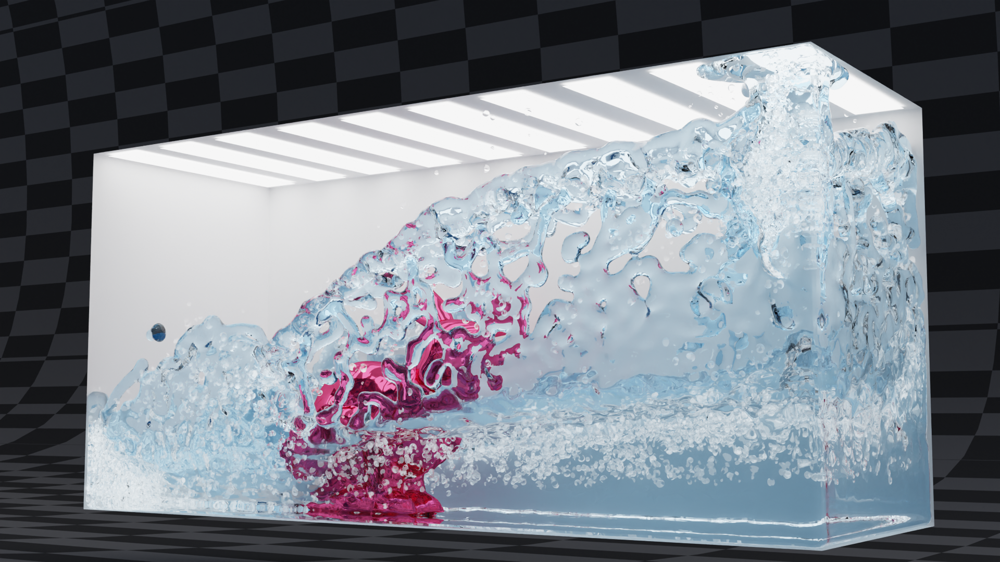

  <h1 align="center">Bunny in the Water</h1>
  

    <a href="https://github.com/DecAd3"><strong>Longteng Duan*</strong></a>
    ·
    <a href="https://github.com/guo-han"><strong>Guo Han*</strong></a>
    ·
    <a href="https://github.com/Ribosome-rbx"><strong>Boxiang Rong*</strong></a>
  

  
<strong>(* Equal Contribution)</strong>

  <h3 align="center"> <a href="">Slides</a> | <a href="">Presentation</a> | <a href="">Demo</a> </h3>
  

    (Click to View our Demo Video)

    Here we present our group project developed for the <a href = "https://crl.ethz.ch/teaching/PBS23/index.html">Physically-based Simulation in Computer Graphics</a> course at ETH Zurich.  Our work involved the implementation of several key features, including position-based fluids (PBF), handling of simple static rigid bodies, and the generation of diffuse materials such as spray, foam, and bubbles.

## Presentation Video

## Environment Setup

## Code Usage
### Real-time Simulation
### Rendering